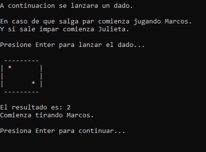
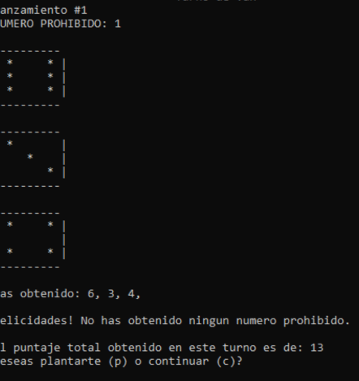
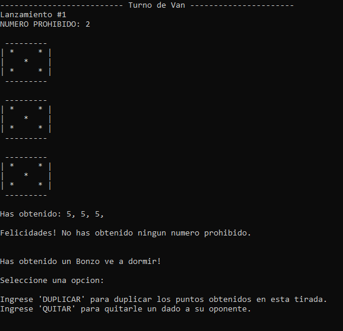
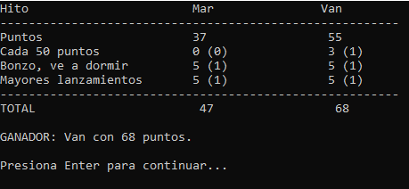
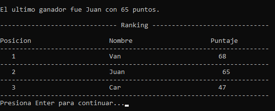

# juego_bonzo_UTN_Programacion

Este es el repositorio para el trabajo integrador del juego de Bonzo, para Programación I de la UTN. 

# Bonzo - Juego de Dados

## Tecnicatura Universitaria en Programación
### Programación I - Examen Integrador

### Descripción del Juego
**Bonzo** es un juego de dados para dos jugadores que combina azar y estrategia. A lo largo de 6 rondas, los jugadores toman decisiones clave para maximizar su puntaje, enfrentando retos y aprovechando la suerte.

**Objetivo:** Sumar la mayor cantidad de puntos posible a lo largo de las 6 rondas. Cada ronda tiene un "número prohibido" correspondiente al número de la ronda, y los jugadores deben evitar obtenerlo en los dados.

## Reglas del Juego

### Inicio
1. Se lanza un dado para determinar qué jugador comienza:
   - Impar: comienza el jugador 1.
   - Par: comienza el jugador 2.
 

### Desarrollo del Juego
- **Rondas:** Cada jugador juega 6 rondas.
- **Lanzamiento de Dados:**
  - Cada jugador lanza tres dados por turno.
  - Si no hay número prohibido, se suman los valores y el jugador decide si seguir lanzando o plantarse.
 

- **Número Prohibido:**
  - Si aparece, el jugador pierde todos los puntos de esa ronda.
  - Dos números prohibidos: se pierde la ronda y se lanzará con dos dados en la próxima.
  - Tres números prohibidos: el jugador pierde automáticamente.

- **Bonzo, ve a dormir:**
  - Si un jugador lanza tres dados iguales que no sean el número prohibido, gana un "Bonzo, ve a dormir" y puede:
    - Quitarle un dado al oponente.
    - Duplicar los puntos obtenidos.
 

### Finalización del Juego
Al finalizar las 6 rondas, se suman los puntos y se otorgan puntos adicionales por hitos:
- Cada “Bonzo ve a dormir”: 5 puntos.
- Superar los 50 puntos: 3 puntos cada 50 puntos superados.
- Ronda con mayor cantidad de lanzamientos exitosos: 5 puntos.

En caso de empate, ambos jugadores reciben los puntos correspondientes. El jugador con el puntaje total más alto será el ganador. Si hay empate total, gana quien haya conseguido más “Bonzo, ve a dormir”.
 

## Actividad
Se solicita desarrollar el juego "Bonzo" en C/C++ utilizando un proyecto de aplicación de consola. El juego debe contar con un menú principal con las siguientes opciones:

### Opción Jugar
- Solicitar el nombre de cada jugador.
- Mostrar la información necesaria durante el juego, incluyendo el número de ronda, el nombre del jugador que está tirando, la tirada de dados, la cantidad de lanzamientos, y la cantidad de puntos.

### Opción Estadísticas
- Mostrar el nombre del jugador con más puntos y su puntaje.
 

### Opción Créditos
- Incluir los nombres y legajos de los integrantes del equipo.

### Opción Salir
- Confirmar si el usuario desea salir.

## Consideraciones Generales
- Realizar el proyecto en grupo utilizando Code::Blocks.
- Uso obligatorio de vectores y funciones.
- Incluir al menos un archivo .h para organizar funciones.
- No usar variables globales.
- Cumplir con requisitos mínimos: menú de inicio, lanzamientos de dados, sumatoria de puntos, alternar turnos y mostrar el ganador.

**Crédito:**
- Creado por el equipo de la materia Programación I (UTN-FRGP) 2024.
- Inspirado en el juego de mesa Bunco.

